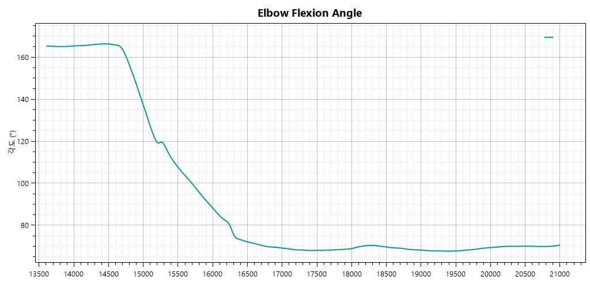
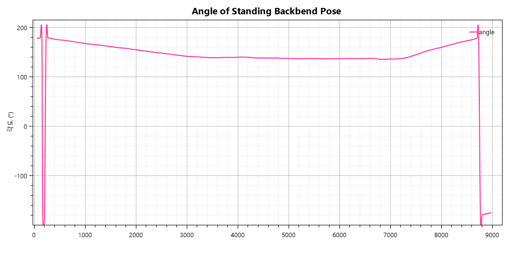

# 유연성 평가

## 01. 프로젝트 배경
### (1) 장시간 공부
- 뻣뻣해지는 근육: 같은 자세로 오래 앉아 있으면 목, 어깨, 허리 근육이 뻣뻣해지고 통증이 유발
- 자세 불균형: 장시간 앉아 있으면 자세가 흐트러져 척추에 부담을 주고, 허리 디스크나 거북목 위험 증가

### (2) 눕기
- 운동 부족: 자주 눕거나 누운 채 시간을 보내면 신체 활동이 줄어들어 체력 저화나 근육 위축
- 허리 통증: 잘못된 자세로 누워 있으면 척추와 허리에 통증 발생

## 02. 프로젝트 분석 및 결과
### (1) 손끝닿기
- 가장 굽혔을 때의 각도를 기준으로 약 +3도 이하일 때를 동작 유지 시간으로 지정

```python
print("가장 굽혔을 때 각도: %.2f" % df_foot['각도'].min())   #가장 굽혔을 때 각도: 67.71

#'각도'가 70도 이하인 경우의 '시간(ms)'값 필터링
foot_time_filter = df_foot[df_foot['각도'] <= 70]['시간(초)']
print(foot_time_filter.max(), foot_time_filter.min()) #20.867 16.767

#동작 유지 시간
foot_time = foot_time_filter.max() - foot_time_filter.min()
print('각도가 70도 이하일 때 유지 시간: %.2f(ms)' % foot_time)   #각도가 70도 이하일 때 유지 시간: 4.10(ms)
```

### (2) 허리 뒤로 젖히기
- 가장 젖혔을 때의 각도를 기준으로 약 +3도 이하일 때를 동작 유지 시간으로 지정
- 단, 허리를 앞으로 숙인 경우 마이너스가 나오기 때문에 'angle' 값이 양수일 때를 기준으로 함

```python
print("가장 굽혔을 때 각도: %.2f" % df_waist[df_waist["angle"] >= 0]["angle"].min())    #가장 굽혔을 때 각도: 135.99

#'angle'이 139도 이하인 경우의 시간(초) 값 필터링
waist_time_filter = df_waist[(df_waist['angle'] > 0) & (df_waist['angle'] <= 139)]['시간(초)']
print(waist_time_filter.max(), waist_time_filter.min()) #7.283 4.333

#동작 유지 시간
waist_time = waist_time_filter.max() - waist_time_filter.min()
print('각도가 139도 이하일 때 유지 시간: %.2f(s)' % waist_time) #각도가 139도 이하일 때 유지 시간: 2.95(s)
```

## 결론
- 평균에 비해 유연성이 많이 떨어져 보임
- 매일 간단한 스트레칭을 하면서 유연성을 기를 필요가 있음